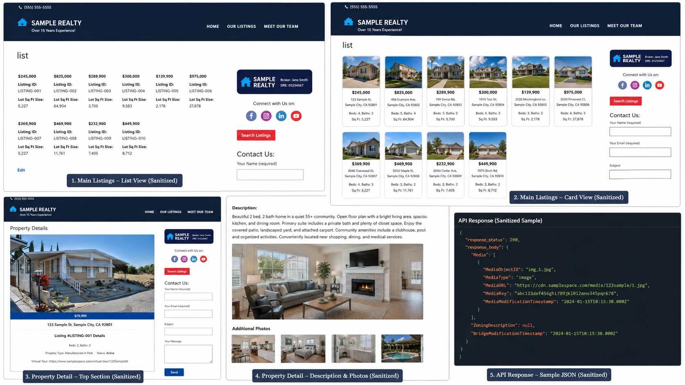

# MLS Dashboard WordPress Plugin Sample

A custom WordPress MLS/IDX integration plugin demonstrating full-stack development, real estate data integration, advanced property search, responsive listing interfaces, and API-driven automation. This sanitized portfolio sample showcases experience building software for the real estate and mortgage ecosystem.

## What it demonstrates

- Frontend property search/listing UI
- MLS/IDX API integration pattern
- Dynamic property-card rendering
- Detail pages with photos, pricing, status, property attributes, and map embedding
- Filtering/sorting-ready JavaScript structure for real estate listings
- WordPress plugin packaging and script/style enqueueing

## Sanitization notice

This repository is a sanitized portfolio sample. Client names, MLS identifiers, API tokens, Google Maps keys, emails, and phone numbers have been replaced with placeholders. It is not intended to connect to a live MLS/IDX feed without valid credentials and proper MLS/IDX authorization.

## Placeholder values

- `BRIDGE_DATA_API_TOKEN_PLACEHOLDER`
- `AGENT_MLS_ID_PLACEHOLDER`
- `GOOGLE_MAPS_API_KEY_PLACEHOLDER`
- `inquiries@example.com`
- `(555) 555-0100`

## Screenshots

The image below is a sanitized portfolio overview of the MLS/IDX plugin interface. Client branding, MLS IDs, listing addresses, phone numbers, API keys, and private client details have been replaced with sample data.

